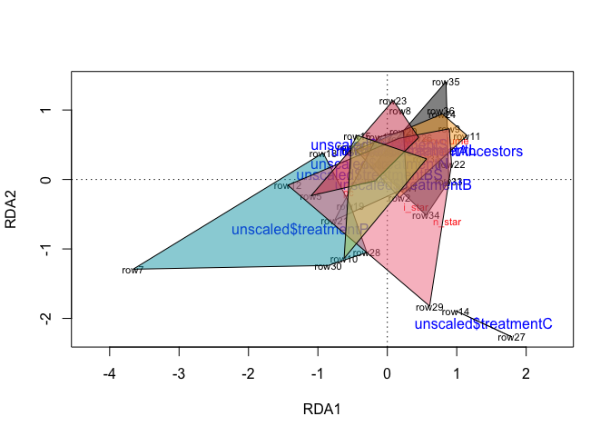
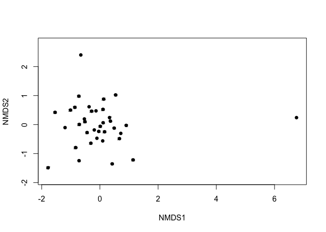
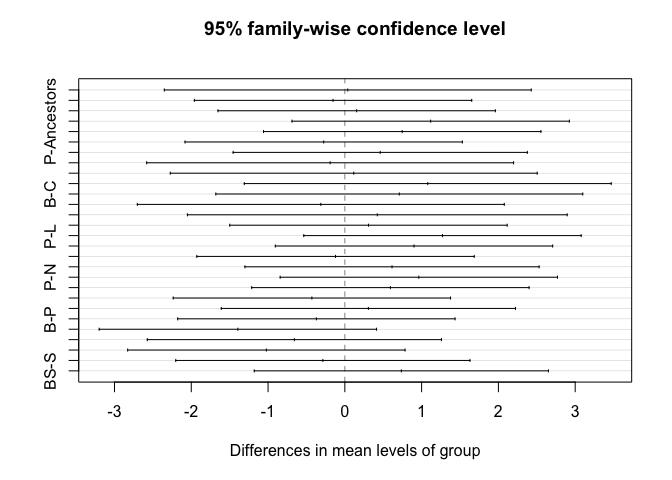
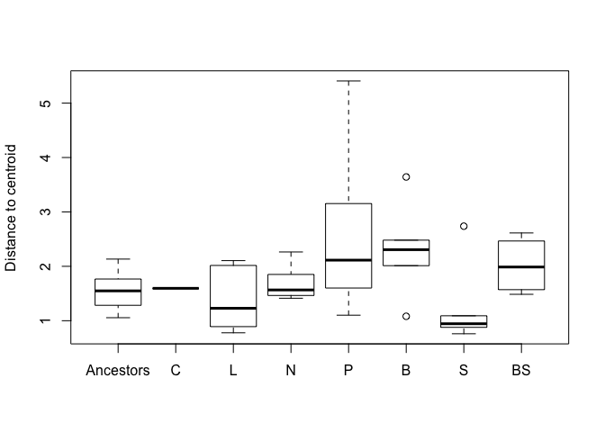
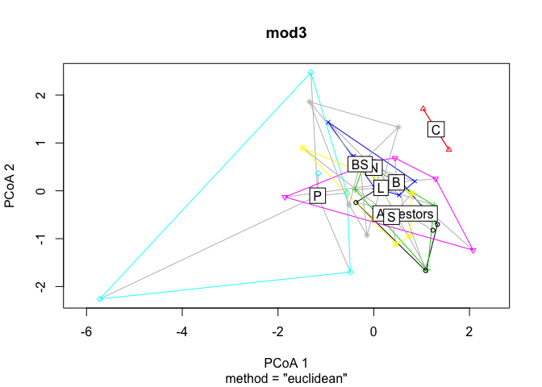
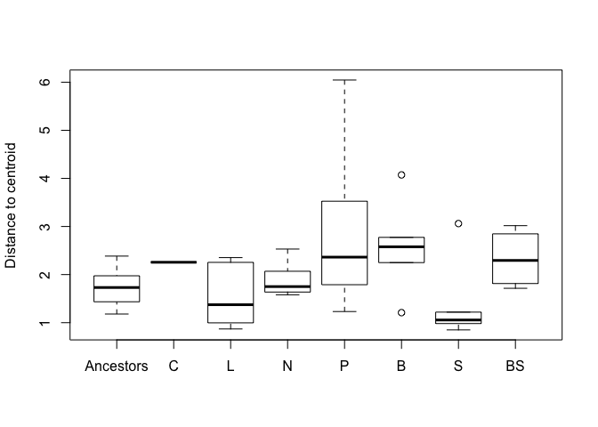
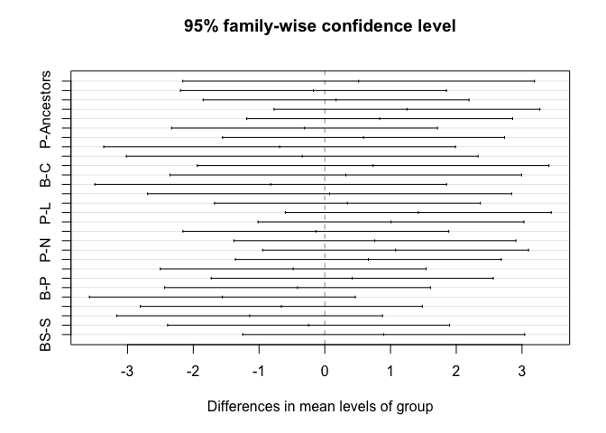

```r
library(tidyverse)
library(cowplot)
library(vegan)
library(here)

all_sizes3 <- read_csv(here("data-processed", "all_cell_sizes_low_resources.csv"))

scaled <- all_sizes3 %>% 
	mutate(treatment = ifelse(treatment == "none", "Ancestors", treatment)) %>% 
	filter(!is.na(phosphate_biovolume)) %>% 
	mutate(avg_biovolume = (nitrate_biovolume + phosphate_biovolume)/3) %>%
	mutate(avg_biovolume = scale(avg_biovolume)) %>%
	mutate(nitrate_biovolume = scale(nitrate_biovolume)) %>%
	mutate(n_star = scale(n_star)) %>%
	mutate(p_star = scale(p_star)) %>%
	mutate(i_star = scale(i_star)) %>%
	mutate(nc = scale(nc)) %>%
	mutate(pc = scale(pc)) %>%
	mutate(phosphate_biovolume = scale(phosphate_biovolume)) %>%
	mutate(light_biovolume = scale(light_biovolume)) %>%
	select(n_star, p_star, phosphate_biovolume, i_star, nc, pc) 


unscaled <- all_sizes3 %>% 
	mutate(treatment = ifelse(treatment == "none", "Ancestors", treatment)) %>% 
	mutate(treatment = factor(treatment,
							  levels=c("Ancestors", "C", "L", "N",
							  		 "P", "B", "S", "BS"))) %>% 
	filter(!is.na(phosphate_biovolume)) %>% 
	select(treatment) 


cols_anc  <- c("black", "#6b6b6b", "#f9a729", "#97cfd0", "#00a2b3", "#f1788d", "#cf3e53", "#b9ca5d")

rda_res <- rda(scaled ~ unscaled$treatment, scale = FALSE)
summary(rda_res)
```

```
## 
## Call:
## rda(formula = scaled ~ unscaled$treatment, scale = FALSE) 
## 
## Partitioning of variance:
##               Inertia Proportion
## Total           6.000     1.0000
## Constrained     1.882     0.3136
## Unconstrained   4.118     0.6864
## 
## Eigenvalues, and their contribution to the variance 
## 
## Importance of components:
##                         RDA1    RDA2    RDA3   RDA4    RDA5     RDA6
## Eigenvalue            0.7940 0.49210 0.33830 0.1122 0.10009 0.044996
## Proportion Explained  0.1323 0.08202 0.05638 0.0187 0.01668 0.007499
## Cumulative Proportion 0.1323 0.21435 0.27074 0.2894 0.30612 0.313621
##                          PC1    PC2    PC3     PC4     PC5    PC6
## Eigenvalue            1.2124 0.9642 0.6871 0.58577 0.43118 0.2376
## Proportion Explained  0.2021 0.1607 0.1145 0.09763 0.07186 0.0396
## Cumulative Proportion 0.5157 0.6764 0.7909 0.88854 0.96040 1.0000
## 
## Accumulated constrained eigenvalues
## Importance of components:
##                        RDA1   RDA2   RDA3    RDA4    RDA5    RDA6
## Eigenvalue            0.794 0.4921 0.3383 0.11222 0.10009 0.04500
## Proportion Explained  0.422 0.2615 0.1798 0.05964 0.05319 0.02391
## Cumulative Proportion 0.422 0.6835 0.8633 0.92290 0.97609 1.00000
## 
## Scaling 2 for species and site scores
## * Species are scaled proportional to eigenvalues
## * Sites are unscaled: weighted dispersion equal on all dimensions
## * General scaling constant of scores:  3.806754 
## 
## 
## Species scores
## 
##                        RDA1    RDA2    RDA3     RDA4     RDA5     RDA6
## n_star               0.8616 -0.6186  0.2534 -0.07117  0.11728 -0.12191
## p_star               0.6723  0.3928 -0.5048  0.25470  0.09194 -0.07242
## phosphate_biovolume  0.4606  0.5536  0.2714 -0.13399 -0.30566 -0.09818
## i_star               0.4101 -0.4095 -0.4716 -0.11621 -0.25272  0.14178
## nc                   0.1758  0.3646 -0.2005 -0.39317  0.23926  0.04131
## pc                  -0.5588 -0.2108 -0.4022 -0.12272 -0.07069 -0.23900
## 
## 
## Site scores (weighted sums of species scores)
## 
##           RDA1     RDA2      RDA3     RDA4     RDA5    RDA6
## row1   0.27905 -0.11628  1.426561 -1.34135 -1.92543 -0.6491
## row2   0.17553 -0.26015  0.004205  0.30551  0.66263 -1.3347
## row3  -0.19138  0.52866  0.370384  3.31842 -0.42914 -0.5426
## row4  -0.17481 -0.01830  0.960809 -1.65930 -2.02976  0.3960
## row5  -1.09795 -0.23332  0.283395  1.52196  1.72933  1.0012
## row6   0.16837  0.59214 -0.365089  2.41508  1.21603 -2.1856
## row7  -3.66186 -1.29179 -2.792391 -0.85373 -3.21647 -6.2547
## row8   0.18519  0.99566  0.894396 -1.94505 -1.58877  0.3781
## row9   0.89227  0.72956  0.528697 -6.86873  2.38182  0.3802
## row10 -0.62272 -1.13648  1.771488  2.64216 -0.62255 -3.2309
## row11  1.14944  0.63293 -1.417268  2.23084 -0.71357 -0.1061
## row12 -1.43313 -0.08250  0.215382 -0.29913  0.16587 -0.6522
## row13 -0.44910  0.42460  0.323604  0.83177 -0.19947  2.0766
## row14  0.98705 -1.89166  1.408283 -0.95428  1.20322 -0.6409
## row15 -0.43238  0.63456 -0.994630  0.08821  1.91501 -0.5463
## row16 -0.10726  0.37644  0.477325  1.71296  0.03696 -1.1120
## row17 -0.10901  0.61455 -0.796075 -0.11411  3.00819  0.2992
## row18 -0.92469  0.38209  0.534528  0.90351  0.68521 -0.8429
## row19 -0.53126 -0.37245 -1.281929 -1.91817 -2.17817  4.8512
## row20  0.23272  0.69623  0.377275 -0.21108  1.75648  4.7059
## row21 -0.75724 -0.58550  0.985604  0.50146  2.82913  0.8257
## row22  0.92459  0.22282  1.003417 -0.84228 -0.29750 -2.1919
## row23  0.08301  1.13706 -0.193881 -0.37629 -1.56503  1.5891
## row24  0.79242  0.94417 -0.855778 -0.89560 -2.91620 -1.0203
## row25 -0.52103  0.47738  1.320315 -2.29259 -2.22868  1.7630
## row26  0.45224  0.60520  1.141668  0.09956 -1.63765 -0.2964
## row27  1.79191 -2.26551 -0.821702  1.63554 -1.94678  1.4902
## row28 -0.29506 -1.05121 -0.041949 -0.05649 -1.55438  1.7891
## row29  0.60952 -1.82394  0.462809 -0.05657 -1.57600  1.3453
## row30 -0.85145 -1.23816  0.554481  1.51098  5.50896  0.8568
## row31  0.56587  0.29709  0.363423  2.33307  1.96748 -2.5659
## row32 -0.19104  0.21183 -0.855973  1.20421 -0.18585  0.4552
## row33  0.88624 -0.02784 -2.536456 -0.59597 -1.66370  3.2771
## row34  0.55843 -0.51533 -0.629431  0.11228  0.84401 -0.8617
## row35  0.84537  1.40747 -0.476142 -0.62817 -0.02842 -3.3030
## row36  0.77216  1.00000 -1.349353 -1.45862  2.59316  0.8572
## 
## 
## Site constraints (linear combinations of constraining variables)
## 
##          RDA1     RDA2    RDA3     RDA4    RDA5     RDA6
## row1  -0.1092  0.22753  0.4727  0.43067  1.0478  0.92784
## row2   0.3122  0.42360 -0.2936  0.83709 -0.6259 -0.29932
## row3  -0.1092  0.22753  0.4727  0.43067  1.0478  0.92784
## row4  -0.1105  0.49726  0.6173 -0.47183 -1.0184  0.61360
## row5  -0.1105  0.49726  0.6173 -0.47183 -1.0184  0.61360
## row6   0.2323 -0.07238  0.3690 -1.13033  0.3780 -0.66085
## row7  -1.2529 -0.71431 -0.6055 -0.08278 -0.1510  0.07990
## row8  -0.1105  0.49726  0.6173 -0.47183 -1.0184  0.61360
## row9   0.2323 -0.07238  0.3690 -1.13033  0.3780 -0.66085
## row10 -0.2526  0.06814  0.6151  0.69271  0.2578 -1.14500
## row11  0.3122  0.42360 -0.2936  0.83709 -0.6259 -0.29932
## row12  0.2323 -0.07238  0.3690 -1.13033  0.3780 -0.66085
## row13  0.3122  0.42360 -0.2936  0.83709 -0.6259 -0.29932
## row14  1.3895 -2.07858  0.2933  0.34063 -0.3718  0.42465
## row15 -0.2526  0.06814  0.6151  0.69271  0.2578 -1.14500
## row16  0.3122  0.42360 -0.2936  0.83709 -0.6259 -0.29932
## row17 -0.1092  0.22753  0.4727  0.43067  1.0478  0.92784
## row18 -1.2529 -0.71431 -0.6055 -0.08278 -0.1510  0.07990
## row19 -1.2529 -0.71431 -0.6055 -0.08278 -0.1510  0.07990
## row20 -0.1092  0.22753  0.4727  0.43067  1.0478  0.92784
## row21 -0.1092  0.22753  0.4727  0.43067  1.0478  0.92784
## row22  0.2323 -0.07238  0.3690 -1.13033  0.3780 -0.66085
## row23 -0.1105  0.49726  0.6173 -0.47183 -1.0184  0.61360
## row24  0.3122  0.42360 -0.2936  0.83709 -0.6259 -0.29932
## row25 -0.2526  0.06814  0.6151  0.69271  0.2578 -1.14500
## row26 -0.1105  0.49726  0.6173 -0.47183 -1.0184  0.61360
## row27  1.3895 -2.07858  0.2933  0.34063 -0.3718  0.42465
## row28 -1.2529 -0.71431 -0.6055 -0.08278 -0.1510  0.07990
## row29  0.2323 -0.07238  0.3690 -1.13033  0.3780 -0.66085
## row30 -1.2529 -0.71431 -0.6055 -0.08278 -0.1510  0.07990
## row31 -0.2526  0.06814  0.6151  0.69271  0.2578 -1.14500
## row32  0.5742  0.41523 -1.1695 -0.27326  0.3118  0.08496
## row33  0.5742  0.41523 -1.1695 -0.27326  0.3118  0.08496
## row34  0.5742  0.41523 -1.1695 -0.27326  0.3118  0.08496
## row35  0.5742  0.41523 -1.1695 -0.27326  0.3118  0.08496
## row36  0.5742  0.41523 -1.1695 -0.27326  0.3118  0.08496
## 
## 
## Biplot scores for constraining variables
## 
##                          RDA1     RDA2    RDA3    RDA4     RDA5     RDA6
## unscaled$treatmentC   0.53116 -0.79458  0.1121  0.1302 -0.14212  0.16233
## unscaled$treatmentL   0.19762  0.26814 -0.1858  0.5299 -0.39621 -0.18947
## unscaled$treatmentN  -0.06911  0.14403  0.2992  0.2726  0.66328  0.58732
## unscaled$treatmentP  -0.79306 -0.45215 -0.3832 -0.0524 -0.09556  0.05057
## unscaled$treatmentB   0.14706 -0.04582  0.2336 -0.7155  0.23930 -0.41831
## unscaled$treatmentS  -0.06992  0.31476  0.3907 -0.2987 -0.64463  0.38841
## unscaled$treatmentBS -0.14074  0.03797  0.3428  0.3860  0.14367 -0.63806
## 
## 
## Centroids for factor constraints
## 
##                                RDA1     RDA2    RDA3     RDA4    RDA5
## unscaled$treatmentAncestors  0.5742  0.41523 -1.1695 -0.27326  0.3118
## unscaled$treatmentC          1.3895 -2.07858  0.2933  0.34063 -0.3718
## unscaled$treatmentL          0.3122  0.42360 -0.2936  0.83709 -0.6259
## unscaled$treatmentN         -0.1092  0.22753  0.4727  0.43067  1.0478
## unscaled$treatmentP         -1.2529 -0.71431 -0.6055 -0.08278 -0.1510
## unscaled$treatmentB          0.2323 -0.07238  0.3690 -1.13033  0.3780
## unscaled$treatmentS         -0.1105  0.49726  0.6173 -0.47183 -1.0184
## unscaled$treatmentBS        -0.2526  0.06814  0.6151  0.69271  0.2578
##                                 RDA6
## unscaled$treatmentAncestors  0.08496
## unscaled$treatmentC          0.42465
## unscaled$treatmentL         -0.29932
## unscaled$treatmentN          0.92784
## unscaled$treatmentP          0.07990
## unscaled$treatmentB         -0.66085
## unscaled$treatmentS          0.61360
## unscaled$treatmentBS        -1.14500
```

```r
coef(rda_res)
```

```
##                             RDA1         RDA2      RDA3        RDA4
## unscaled$treatmentC   0.21415826 -0.655101520 0.3842542  0.16126220
## unscaled$treatmentL  -0.06883216  0.002199647 0.2300880  0.29167880
## unscaled$treatmentN  -0.17952401 -0.049305857 0.4313965  0.18491492
## unscaled$treatmentP  -0.47996199 -0.296717647 0.1481627  0.05003581
## unscaled$treatmentB  -0.08981569 -0.128090804 0.4041538 -0.22514491
## unscaled$treatmentS  -0.17986355  0.021548962 0.4693627 -0.05216250
## unscaled$treatmentBS -0.21719256 -0.091176692 0.4688035  0.25375136
##                             RDA5         RDA6
## unscaled$treatmentC  -0.17958082  0.089233269
## unscaled$treatmentL  -0.24634413 -0.100946231
## unscaled$treatmentN   0.19334171  0.221417385
## unscaled$treatmentP  -0.12157634 -0.001330174
## unscaled$treatmentB   0.01739059 -0.195917481
## unscaled$treatmentS  -0.34943617  0.138869885
## unscaled$treatmentBS -0.01419226 -0.323100922
```

```r
r2_adj <- RsquareAdj(rda_res)$adj.r.squared
r2_adj
```

```
## [1] 0.1420264
```

```r
r2 <- RsquareAdj(rda_res)$r.squared
r2
```

```
## [1] 0.3136212
```

```r
plot(rda_res)
ordihull(rda_res, groups = unscaled$treatment, col = cols_anc, draw = "polygon")
```

<!-- -->

```r
anova.cca(rda_res, by = "axis", step = 1000)
```

```
## Permutation test for rda under reduced model
## Forward tests for axes
## Permutation: free
## Number of permutations: 999
## 
## Model: rda(formula = scaled ~ unscaled$treatment, scale = FALSE)
##          Df Variance      F Pr(>F)  
## RDA1      1   0.7940 5.5913  0.024 *
## RDA2      1   0.4921 3.4652  0.210  
## RDA3      1   0.3383 2.3822  0.621  
## RDA4      1   0.1122 0.7902  0.995  
## RDA5      1   0.1001 0.7048  0.991  
## RDA6      1   0.0450 0.3169  1.000  
## Residual 29   4.1183                
## ---
## Signif. codes:  0 '***' 0.001 '**' 0.01 '*' 0.05 '.' 0.1 ' ' 1
```

```r
?vegdist

distances <- vegdist(scaled, method = "euclidean")


ordination <- metaMDS(scaled,distance="euclidean",trymax=100)
```

```
## Run 0 stress 0.1643835 
## Run 1 stress 0.1783038 
## Run 2 stress 0.1630609 
## ... New best solution
## ... Procrustes: rmse 0.03486574  max resid 0.08826293 
## Run 3 stress 0.1750242 
## Run 4 stress 0.1631482 
## ... Procrustes: rmse 0.008450549  max resid 0.04205613 
## Run 5 stress 0.1631502 
## ... Procrustes: rmse 0.008286634  max resid 0.04175582 
## Run 6 stress 0.1752947 
## Run 7 stress 0.167631 
## Run 8 stress 0.1643803 
## Run 9 stress 0.1701584 
## Run 10 stress 0.1765164 
## Run 11 stress 0.1674946 
## Run 12 stress 0.1746667 
## Run 13 stress 0.1745934 
## Run 14 stress 0.1718474 
## Run 15 stress 0.1908958 
## Run 16 stress 0.1676223 
## Run 17 stress 0.1675043 
## Run 18 stress 0.1720883 
## Run 19 stress 0.1674917 
## Run 20 stress 0.1637269 
## Run 21 stress 0.1676382 
## Run 22 stress 0.1900763 
## Run 23 stress 0.174156 
## Run 24 stress 0.1630567 
## ... New best solution
## ... Procrustes: rmse 0.0007066197  max resid 0.00264872 
## ... Similar to previous best
## *** Solution reached
```

```r
ordination$stress
```

```
## [1] 0.1630567
```

```r
plot(ordination, type = "t",cex=.5)
site.scaling <- as.data.frame(ordination$points)
points(site.scaling,pch=16)
```

<!-- -->

```r
mod <- betadisper(distances, unscaled$treatment)
anova(mod)
```

```
## Analysis of Variance Table
## 
## Response: Distances
##           Df  Sum Sq Mean Sq F value Pr(>F)
## Groups     7  7.7998 1.11425  1.4612 0.2214
## Residuals 28 21.3515 0.76256
```

```r
## Permutation test for F
permutest(mod, pairwise = TRUE, permutations = 99)
```

```
## 
## Permutation test for homogeneity of multivariate dispersions
## Permutation: free
## Number of permutations: 99
## 
## Response: Distances
##           Df  Sum Sq Mean Sq      F N.Perm Pr(>F)
## Groups     7  7.7998 1.11425 1.4612     99   0.24
## Residuals 28 21.3515 0.76256                     
## 
## Pairwise comparisons:
## (Observed p-value below diagonal, permuted p-value above diagonal)
##           Ancestors       C       L       N       P       B       S   BS
## Ancestors           0.90000 0.72000 0.67000 0.18000 0.13000 0.49000 0.15
## C           0.90817         0.74000 0.69000 0.49000 0.33000 0.65000 0.43
## L           0.65922 0.69783         0.40000 0.21000 0.09000 0.84000 0.19
## N           0.54630 0.67778 0.36411         0.25000 0.20000 0.26000 0.37
## P           0.19248 0.43615 0.15601 0.25105         0.75000 0.14000 0.57
## B           0.13775 0.35141 0.10792 0.21616 0.68023         0.10000 0.67
## S           0.52377 0.63248 0.79899 0.31452 0.13859 0.10152         0.19
## BS          0.18906 0.35148 0.16245 0.33332 0.48725 0.60132 0.16805
```

```r
## Tukey's Honest Significant Differences
(mod.HSD <- TukeyHSD(mod))
```

```
##   Tukey multiple comparisons of means
##     95% family-wise confidence level
## 
## Fit: aov(formula = distances ~ group, data = df)
## 
## $group
##                     diff        lwr       upr     p adj
## C-Ancestors   0.03802514 -2.3512253 2.4272756 1.0000000
## L-Ancestors  -0.15366798 -1.9597715 1.6524356 0.9999917
## N-Ancestors   0.15415153 -1.6519520 1.9602551 0.9999915
## P-Ancestors   1.11787703 -0.6882265 2.9239806 0.4846941
## B-Ancestors   0.74707689 -1.0590267 2.5531804 0.8702757
## S-Ancestors  -0.27510727 -2.0812108 1.5309963 0.9995800
## BS-Ancestors  0.46073137 -1.4549307 2.3763935 0.9925261
## L-C          -0.19169312 -2.5809435 2.1975573 0.9999945
## N-C           0.11612639 -2.2731240 2.5053768 0.9999998
## P-C           1.07985189 -1.3093985 3.4691023 0.8122658
## B-C           0.70905175 -1.6801987 3.0983022 0.9750390
## S-C          -0.31313241 -2.7023828 2.0761180 0.9998448
## BS-C          0.42270623 -2.0504029 2.8958154 0.9991108
## N-L           0.30781951 -1.4982840 2.1139231 0.9991271
## P-L           1.27154501 -0.5345585 3.0776486 0.3272395
## B-L           0.90074487 -0.9053587 2.7068484 0.7284680
## S-L          -0.12143929 -1.9275428 1.6846643 0.9999984
## BS-L          0.61439935 -1.3012627 2.5300615 0.9621072
## P-N           0.96372550 -0.8423780 2.7698290 0.6595519
## B-N           0.59292536 -1.2131782 2.3990289 0.9571930
## S-N          -0.42925880 -2.2353623 1.3768447 0.9930375
## BS-N          0.30657984 -1.6090823 2.2222419 0.9994197
## B-P          -0.37080014 -2.1769037 1.4353034 0.9971541
## S-P          -1.39298430 -3.1990878 0.4131193 0.2273564
## BS-P         -0.65714566 -2.5728078 1.2585164 0.9463797
## S-B          -1.02218416 -2.8282877 0.7839194 0.5931350
## BS-B         -0.28634552 -2.2020076 1.6293166 0.9996289
## BS-S          0.73583864 -1.1798235 2.6515007 0.9071016
```

```r
plot(mod.HSD)
```

<!-- -->

```r
boxplot(mod)
```

<!-- -->

```r
### check to make sure treatment groups have equal dispersions
mod3 <- betadisper(distances, unscaled$treatment, bias.adjust = TRUE)
mod3
```

```
## 
## 	Homogeneity of multivariate dispersions
## 
## Call: betadisper(d = distances, group = unscaled$treatment,
## bias.adjust = TRUE)
## 
## No. of Positive Eigenvalues: 6
## No. of Negative Eigenvalues: 0
## 
## Average distance to median:
## Ancestors         C         L         N         P         B         S 
##     1.741     2.256     1.569     1.914     2.991     2.577     1.434 
##        BS 
##     2.330 
## 
## Eigenvalues for PCoA axes:
## PCoA1 PCoA2 PCoA3 PCoA4 PCoA5 PCoA6 
## 65.45 39.88 34.86 31.55 23.95 14.31
```

```r
permutest(mod3, permutations = 99)
```

```
## 
## Permutation test for homogeneity of multivariate dispersions
## Permutation: free
## Number of permutations: 99
## 
## Response: Distances
##           Df  Sum Sq Mean Sq      F N.Perm Pr(>F)
## Groups     7  9.7998 1.39998 1.4648     99   0.19
## Residuals 28 26.7610 0.95575
```

```r
anova(mod3) ### this tells me that the treatments have equal dispersions
```

```
## Analysis of Variance Table
## 
## Response: Distances
##           Df  Sum Sq Mean Sq F value Pr(>F)
## Groups     7  9.7998 1.39998  1.4648 0.2202
## Residuals 28 26.7610 0.95575
```

```r
plot(mod3)
```

<!-- -->

```r
boxplot(mod3)
```

<!-- -->

```r
plot(TukeyHSD(mod3))
```

<!-- -->

```r
unscaled$treatment %>% 
  data_frame(treatment = .) %>% 
  adonis(distances ~ treatment, data = .)
```

```
## 
## Call:
## adonis(formula = distances ~ treatment, data = .) 
## 
## Permutation: free
## Number of permutations: 999
## 
## Terms added sequentially (first to last)
## 
##           Df SumsOfSqs MeanSqs F.Model      R2 Pr(>F)   
## treatment  7     65.86  9.4086  1.8277 0.31362  0.007 **
## Residuals 28    144.14  5.1478         0.68638          
## Total     35    210.00                 1.00000          
## ---
## Signif. codes:  0 '***' 0.001 '**' 0.01 '*' 0.05 '.' 0.1 ' ' 1
```
